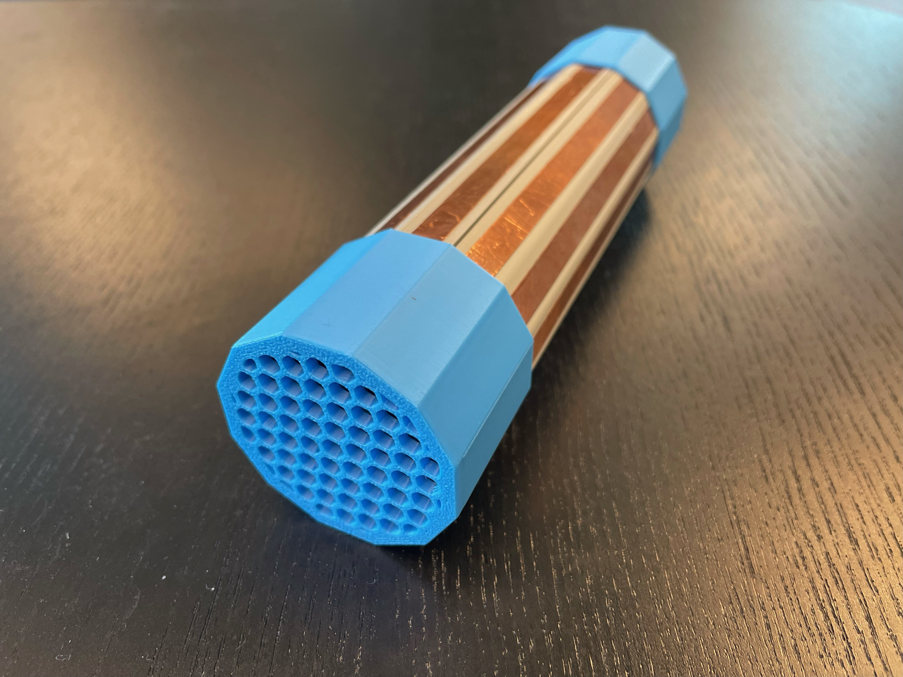

 
# Musical Grasping Training Aid

## Overview

The Musical Grasping Training Aid is an assistive technology device that plays music when the device is grasped and pauses when it is let go. The user may upload their selection of songs onto the microSD card inside the device.

The device is comprised of off-the-shelf electronics and 3D printed parts.

The Musical Grasping Training Aid is open assistive technology (OpenAT). Under the terms of the open source licenses, the device may be built, used, and improved upon by anyone.

The overall cost of materials is about $90 (plus $5 for component shipping).

## Makers Making Change Assistive Device Library
<MMCWebLink>

## How to Obtain the Device
### 1. Do-it-Yourself (DIY) or Do-it-Together (DIT)

This is an open-source assistive technology, so anyone is free to build it. All of the files and instructions required to build the device are contained within this repository. Refer to the Maker Guide below.

### 2. Request a build of this device

You may also submit a build request through the [Makers Making Change Assistive Device Library Listing](<MMCWebLink>) to have a volunteer maker build the device. As the requestor, you are responsible for reimbursing the maker for the cost of materials and any shipping.

### 3. Build this device for someone else

If you have the skills and equipment to build this device, and would like to donate your time to create the device for someone who needs it, visit the [MMC Maker Wanted](https://makersmakingchange.com/maker-wanted/) section.

## Build Instructions

### 1. Read through the Maker Guide

The [Maker Guide](/Documentation/Musical_Grasping_Training_Aid_Maker_Guide.pdf)  contains all the necessary information to build this device, including tool lists, assembly instructions, programming instructions and testing.

### 2. Order the Off-The-Shelf Components

The [Bill of Materials](/Documentation/Musical_Grasping_Training_Aid_BOM.xlsx) lists all of the parts and components required to build the device.

### 3. Print the 3D Printable components

All of the files and individual print files can be found in the [/Build_Files/3D_Printing_Files](/Build_Files/3D_Printing_Files/) folder.

### 4. Assemble the Musical Grasping Training Aid

Reference the Assembly Guide section of the [Maker Guide](/Documentation/Musical_Grasping_Training_Aid_Maker_Guide.pdf) for the tools and steps required to build the device.

## How to improve this Device
As open source assistive technology, you are welcomed and encouraged to improve upon the design. 

## Files
### Documentation
| Document             | Version | Link |
|----------------------|---------|------|
| Design Rationale     | 1.0     | [Musical_Grasping_Training_Aid_Design_Rationale](/Documentation/Musical_Grasping_Training_Aid_Design_Rationale.pdf)     |
| Maker Guide          | 1.0     | [Musical_Grasping_Training_Aid_Maker_Guide](/Documentation/Musical_Grasping_Training_Aid_Maker_Guide.pdf)     |
| Bill of Materials    | 1.0     | [Musical_Grasping_Training_Aid_Bill_of_Materials](/Documentation/Musical_Grasping_Training_Aid_BOM.xlsx)     |
| User Guide           | 1.0     | [Musical_Grasping_Training_Aid_User_Guide](/Documentation/Musical_Grasping_Training_Aid_User_Guide.pdf)    |
| Changelog            | 1.0     | [Changelog](CHANGES.txt)     |

### Design Files
 - [CAD Files](/Design_Files/CAD_Design_Files)

### Build Files
 - [3D Printing Files](/Build_Files/3D_Printing_Files)
 - [Firmware Files](/Build_Files/Firmware_Files)

## License
Copyright (c) 2024 Neil Squire / Makers Making Change.

This repository describes Open Hardware:
 - Everything needed or used to design, make, test, or prepare the Musical Grasping Training Aid is licensed under the [CERN 2.0 Weakly Reciprocal license (CERN-OHL-W v2) or later](https://cern.ch/cern-ohl ) .
 - All software is under the [GNU General Public License v3.0 (GPL-3.0)](https://www.gnu.org/licenses/gpl.html).
 - Accompanying material such as instruction manuals, videos, and other copyrightable works that are useful but not necessary to design, make, test, or prepare the <Device-Name> are published under a [Creative Commons Attribution-ShareAlike 4.0 license (CC BY-SA 4.0)](https://creativecommons.org/licenses/by-sa/4.0/) .

You may redistribute and modify this documentation and make products using it under the terms of the [CERN-OHL-W v2](https://cern.ch/cern-ohl).
This documentation is distributed WITHOUT ANY EXPRESS OR IMPLIED WARRANTY, INCLUDING OF MERCHANTABILITY, SATISFACTORY QUALITY AND FITNESS FOR A PARTICULAR PURPOSE.
Please see the CERN-OHL-W v2 for applicable conditions.

Source Location: <Repository_Link> 

## Attribution

The device was designed by Neil Squire Society. 

The documentation template was created by Makers Making Change / Neil Squire Society and is used under a CC BY-SA 4.0 license. It is available at the following link: [https://github.com/makersmakingchange/OpenAT-Template](https://github.com/makersmakingchange/OpenAT-Template)

### Contributors
 - Didi Dimitrova
 - Brad Wellington
 - Jake McIvor
 - Derrick Andrews

---

## About Makers Making Change

Makers Making Change is a program of [Neil Squire](https://www.neilsquire.ca/), a Canadian non-profit that uses technology, knowledge, and passion to empower people with disabilities.

Makers Making Change leverages the capacity of community based Makers, Disability Professionals and Volunteers to develop and deliver affordable Open Source Assistive Technologies.

 - Website: [www.MakersMakingChange.com](https://www.makersmakingchange.com/)
 - GitHub: [makersmakingchange](https://github.com/makersmakingchange)
 - X (formerly Twitter): [@makermakechange](https://twitter.com/makermakechange)
 - Instagram: [@makersmakingchange](https://www.instagram.com/makersmakingchange)
 - Facebook: [makersmakechange](https://www.facebook.com/makersmakechange)
 - LinkedIn: [Neil Squire Society](https://www.linkedin.com/company/neil-squire-society/)
 - Thingiverse: [makersmakingchange](https://www.thingiverse.com/makersmakingchange/about)
 - Printables: [MakersMakingChange](https://www.printables.com/@MakersMakingChange)

### Contact Us
For technical questions, to get involved, or to share your experience we encourage you to [visit our website](https://www.makersmakingchange.com/) or [contact us](https://www.makersmakingchange.com/s/contact).
